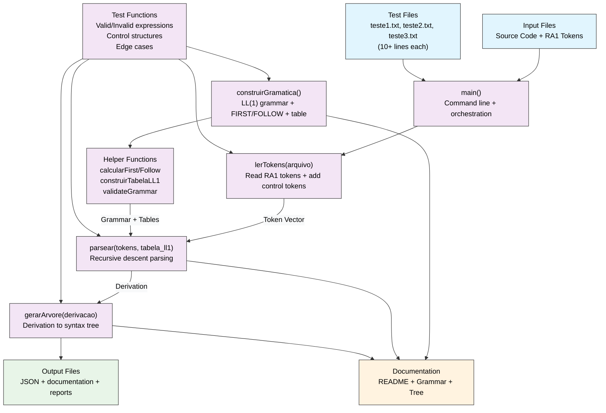
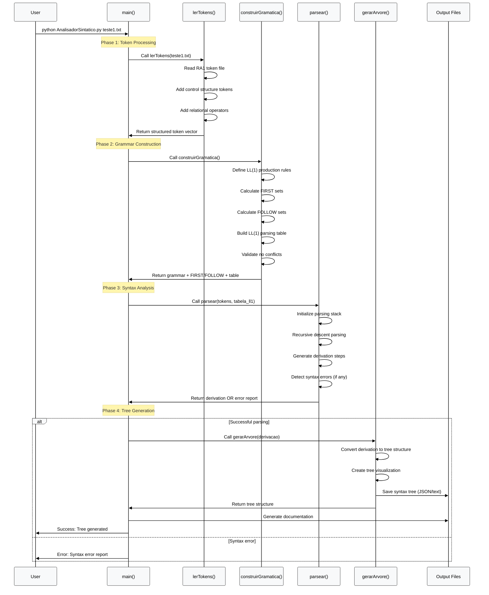
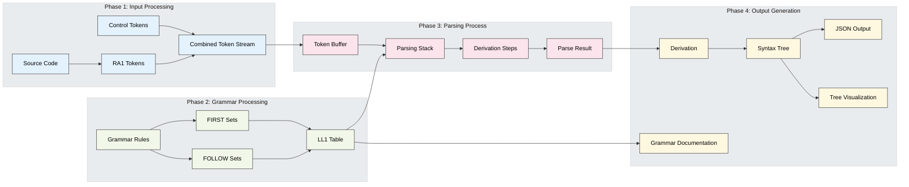
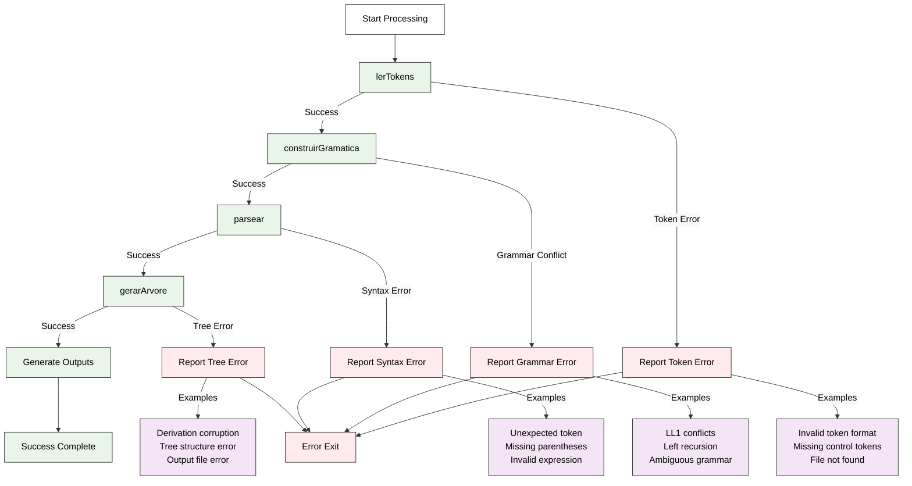

# RA2 Project Architecture Overview

## Complete System Flowchart

```mermaid
%%{init: {'theme':'base', 'themeVariables': { 'primaryColor': '#ffffff', 'primaryTextColor': '#000000', 'primaryBorderColor': '#333333', 'lineColor': '#333333', 'secondaryColor': '#f8f9fa', 'tertiaryColor': '#e9ecef'}}}%%
flowchart TD
    %% Input/Output Files
    A["Input Files<br/>Source Code + RA1 Tokens"] 
    
    B["Test Files<br/>teste1.txt, teste2.txt, teste3.txt<br/>(10+ lines each)"]
    
    %% Main Components
    C["main()<br/>Command line + orchestration"]
    
    D["lerTokens(arquivo)<br/>Read RA1 tokens + add control tokens"]
    
    E["construirGramatica()<br/>LL(1) grammar + FIRST/FOLLOW + table"]
    
    F["parsear(tokens, tabela_ll1)<br/>Recursive descent parsing"]
    
    G["gerarArvore(derivacao)<br/>Derivation to syntax tree"]
    
    %% Output Files
    H["Output Files<br/>JSON + documentation + reports"]
    
    I["Documentation<br/>README + Grammar + Tree"]
    
    %% Helper Functions
    J["Helper Functions<br/>calcularFirst/Follow<br/>construirTabelaLL1<br/>validateGrammar"]
    
    %% Test Functions
    K["Test Functions<br/>Valid/Invalid expressions<br/>Control structures<br/>Edge cases"]
    
    %% Connections
    A --> C
    B --> C
    C --> D
    D --> |Token Vector| F
    E --> J
    J --> |Grammar + Tables| F
    F --> |Derivation| G
    G --> H
    E --> I
    F --> I
    G --> I
    
    %% Testing connections  
    K --> D
    K --> E
    K --> F
    K --> G
    
    %% Styling
    classDef inputFiles fill:#e1f5fe
    classDef functions fill:#f3e5f5
    classDef outputFiles fill:#e8f5e8
    classDef documentation fill:#fff3e0
    
    class A,B inputFiles
    class C,D,E,F,G,J,K functions
    class H outputFiles
    class I documentation
```

## System Integration Flow

```mermaid
%%{init: {'theme':'base', 'themeVariables': { 'primaryColor': '#ffffff', 'primaryTextColor': '#000000', 'primaryBorderColor': '#333333', 'lineColor': '#333333', 'actorBkg': '#f8f9fa', 'actorTextColor': '#000000', 'actorLineColor': '#333333', 'signalColor': '#000000', 'signalTextColor': '#000000'}}}%%
sequenceDiagram
    participant User
    participant Main as main()
    participant LT as lerTokens()
    participant CG as construirGramatica()
    participant P as parsear()
    participant GA as gerarArvore()
    participant Files as Output Files
    
    User->>Main: python AnalisadorSintatico.py teste1.txt
    
    Note over Main: Phase 1: Token Processing
    Main->>LT: Call lerTokens(teste1.txt)
    LT->>LT: Read RA1 token file
    LT->>LT: Add control structure tokens
    LT->>LT: Add relational operators
    LT->>Main: Return structured token vector
    
    Note over Main: Phase 2: Grammar Construction
    Main->>CG: Call construirGramatica()
    CG->>CG: Define LL(1) production rules
    CG->>CG: Calculate FIRST sets
    CG->>CG: Calculate FOLLOW sets  
    CG->>CG: Build LL(1) parsing table
    CG->>CG: Validate no conflicts
    CG->>Main: Return grammar + FIRST/FOLLOW + table
    
    Note over Main: Phase 3: Syntax Analysis
    Main->>P: Call parsear(tokens, tabela_ll1)
    P->>P: Initialize parsing stack
    P->>P: Recursive descent parsing
    P->>P: Generate derivation steps
    P->>P: Detect syntax errors (if any)
    P->>Main: Return derivation OR error report
    
    Note over Main: Phase 4: Tree Generation
    alt Successful parsing
        Main->>GA: Call gerarArvore(derivacao)
        GA->>GA: Convert derivation to tree structure
        GA->>GA: Create tree visualization
        GA->>Files: Save syntax tree (JSON/text)
        GA->>Main: Return tree structure
        Main->>Files: Generate documentation
        Main->>User: Success: Tree generated
    else Syntax error
        Main->>User: Error: Syntax error report
    end
```

## Data Flow Architecture

```mermaid
%%{init: {'theme':'base', 'themeVariables': { 'primaryColor': '#ffffff', 'primaryTextColor': '#000000', 'primaryBorderColor': '#333333', 'lineColor': '#333333', 'secondaryColor': '#f8f9fa', 'tertiaryColor': '#e9ecef'}}}%%
graph LR
    %% Phase 1: Input Processing
    subgraph "Phase 1: Input Processing"
        A1[Source Code] --> A2[RA1 Tokens]
        A3[Control Tokens] --> A4[Combined Token Stream]
        A2 --> A4
    end
    
    %% Phase 2: Grammar Processing  
    subgraph "Phase 2: Grammar Processing"
        B1[Grammar Rules] --> B2[FIRST Sets]
        B1 --> B3[FOLLOW Sets]
        B2 --> B4[LL1 Table]
        B3 --> B4
    end
    
    %% Phase 3: Parsing
    subgraph "Phase 3: Parsing Process"
        C1[Token Buffer] --> C2[Parsing Stack]
        C2 --> C3[Derivation Steps]
        C3 --> C4[Parse Result]
    end
    
    %% Phase 4: Output Generation
    subgraph "Phase 4: Output Generation"
        D1[Derivation] --> D2[Syntax Tree]
        D2 --> D3[JSON Output]
        D2 --> D4[Tree Visualization]
        B4 --> D5[Grammar Documentation]
    end
    
    %% Connections between phases
    A4 --> C1
    B4 --> C2
    C4 --> D1
    
    %% Styling
    classDef phase1 fill:#e3f2fd
    classDef phase2 fill:#f1f8e9  
    classDef phase3 fill:#fce4ec
    classDef phase4 fill:#fff8e1
    
    class A1,A2,A3,A4 phase1
    class B1,B2,B3,B4 phase2
    class C1,C2,C3,C4 phase3
    class D1,D2,D3,D4,D5 phase4
```

## Error Handling Flow

```mermaid
%%{init: {'theme':'base', 'themeVariables': { 'primaryColor': '#ffffff', 'primaryTextColor': '#000000', 'primaryBorderColor': '#333333', 'lineColor': '#333333', 'secondaryColor': '#f8f9fa', 'tertiaryColor': '#e9ecef'}}}%%
flowchart TD
    A[Start Processing] --> B[lerTokens]
    B --> |Success| C[construirGramatica]
    B --> |Token Error| E1[Report Token Error]
    
    C --> |Success| D[parsear]
    C --> |Grammar Conflict| E2[Report Grammar Error]
    
    D --> |Success| F[gerarArvore]
    D --> |Syntax Error| E3[Report Syntax Error]
    
    F --> |Success| G[Generate Outputs]
    F --> |Tree Error| E4[Report Tree Error]
    
    G --> H[Success Complete]
    
    E1 --> I[Error Exit]
    E2 --> I
    E3 --> I  
    E4 --> I
    
    %% Error types
    E1 --> |Examples| J1[Invalid token format<br/>Missing control tokens<br/>File not found]
    E2 --> |Examples| J2[LL1 conflicts<br/>Left recursion<br/>Ambiguous grammar]
    E3 --> |Examples| J3[Unexpected token<br/>Missing parentheses<br/>Invalid expression]
    E4 --> |Examples| J4[Derivation corruption<br/>Tree structure error<br/>Output file error]
    
    classDef errorNode fill:#ffebee
    classDef successNode fill:#e8f5e8
    classDef exampleNode fill:#f3e5f5
    
    class E1,E2,E3,E4,I errorNode
    class B,C,D,F,G,H successNode
    class J1,J2,J3,J4 exampleNode
```
