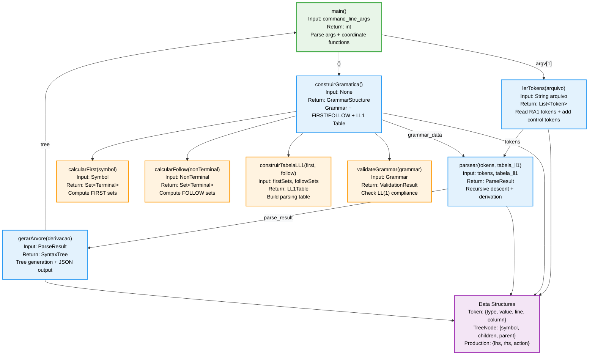
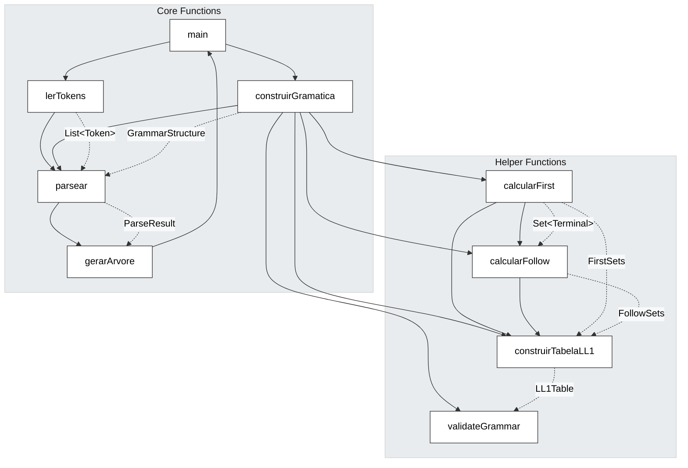
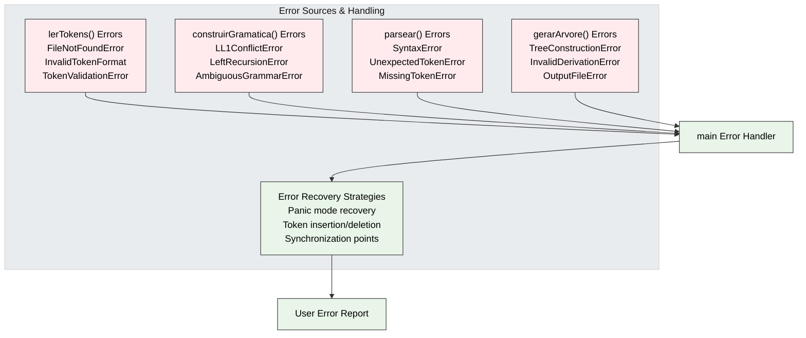
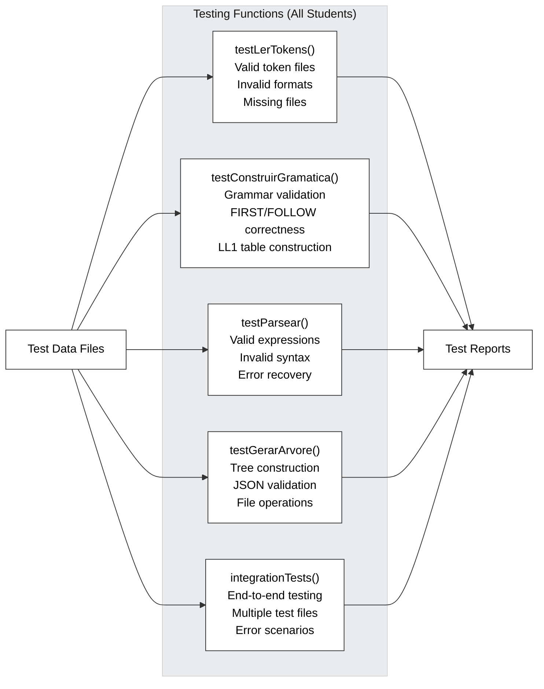

# RA2 Function Interface Specifications

## Detailed Function Interface Flowchart

```mermaid
%%{init: {'theme':'base', 'themeVariables': { 'primaryColor': '#ffffff', 'primaryTextColor': '#000000', 'primaryBorderColor': '#333333', 'lineColor': '#333333', 'secondaryColor': '#f8f9fa', 'tertiaryColor': '#e9ecef'}}}%%
flowchart TD
    %% Main Function
    A["main()<br/>Input: command_line_args<br/>Return: int<br/>Parse args + coordinate functions"]
    
    %% lerTokens Function
    B["lerTokens(arquivo)<br/>Input: String arquivo<br/>Return: List&lt;Token&gt;<br/>Read RA1 tokens + add control tokens"]
    
    %% construirGramatica Function  
    C["construirGramatica()<br/>Input: None<br/>Return: GrammarStructure<br/>Grammar + FIRST/FOLLOW + LL1 Table"]
    
    %% parsear Function
    D["parsear(tokens, tabela_ll1)<br/>Input: tokens, tabela_ll1<br/>Return: ParseResult<br/>Recursive descent + derivation"]
    
    %% gerarArvore Function
    E["gerarArvore(derivacao)<br/>Input: ParseResult<br/>Return: SyntaxTree<br/>Tree generation + JSON output"]
    
    %% Helper Functions
    F["calcularFirst(symbol)<br/>Input: Symbol<br/>Return: Set&lt;Terminal&gt;<br/>Compute FIRST sets"]
    
    G["calcularFollow(nonTerminal)<br/>Input: NonTerminal<br/>Return: Set&lt;Terminal&gt;<br/>Compute FOLLOW sets"]
    
    H["construirTabelaLL1(first, follow)<br/>Input: firstSets, followSets<br/>Return: LL1Table<br/>Build parsing table"]
    
    I["validateGrammar(grammar)<br/>Input: Grammar<br/>Return: ValidationResult<br/>Check LL(1) compliance"]
    
    %% Data Structures
    J["Data Structures<br/>Token: {type, value, line, column}<br/>TreeNode: {symbol, children, parent}<br/>Production: {lhs, rhs, action}"]
    
    %% Function Call Flow
    A --> |"argv[1]"| B
    B --> |"tokens"| D
    A --> |"()"| C  
    C --> |"grammar_data"| D
    D --> |"parse_result"| E
    E --> |"tree"| A
    
    %% Helper function calls
    C --> F
    C --> G  
    C --> H
    C --> I
    
    %% Data structure relationships
    B --> J
    C --> J
    D --> J
    E --> J
    
    %% Styling
    classDef mainFunc fill:#e8f5e8,stroke:#4caf50,stroke-width:3px
    classDef coreFunc fill:#e3f2fd,stroke:#2196f3,stroke-width:2px
    classDef helperFunc fill:#fff3e0,stroke:#ff9800,stroke-width:2px
    classDef dataStruct fill:#f3e5f5,stroke:#9c27b0,stroke-width:2px
    
    class A mainFunc
    class B,C,D,E coreFunc
    class F,G,H,I helperFunc
    class J dataStruct
```

## Function Interface Dependencies

```mermaid
%%{init: {'theme':'base', 'themeVariables': { 'primaryColor': '#ffffff', 'primaryTextColor': '#000000', 'primaryBorderColor': '#333333', 'lineColor': '#333333', 'secondaryColor': '#f8f9fa', 'tertiaryColor': '#e9ecef'}}}%%
graph TD
    %% Core Function Dependencies
    subgraph "Core Functions"
        A[main] --> B[lerTokens]
        A --> C[construirGramatica]
        B --> D[parsear]
        C --> D
        D --> E[gerarArvore]
        E --> A
    end
    
    %% Helper Function Dependencies
    subgraph "Helper Functions"
        C --> F[calcularFirst]
        C --> G[calcularFollow]
        C --> H[construirTabelaLL1]
        C --> I[validateGrammar]
        F --> G
        F --> H
        G --> H
    end
    
    %% Data Flow Labels
    B -.->|"List&lt;Token&gt;"| D
    C -.->|"GrammarStructure"| D
    D -.->|"ParseResult"| E
    F -.->|"Set&lt;Terminal&gt;"| G
    F -.->|"FirstSets"| H
    G -.->|"FollowSets"| H
    H -.->|"LL1Table"| I
```

## Error Propagation Flow

```mermaid
%%{init: {'theme':'base', 'themeVariables': { 'primaryColor': '#ffffff', 'primaryTextColor': '#000000', 'primaryBorderColor': '#333333', 'lineColor': '#333333', 'secondaryColor': '#f8f9fa', 'tertiaryColor': '#e9ecef'}}}%%
flowchart TD
    subgraph "Error Sources & Handling"
        A["lerTokens() Errors<br/>FileNotFoundError<br/>InvalidTokenFormat<br/>TokenValidationError"]
        
        B["construirGramatica() Errors<br/>LL1ConflictError<br/>LeftRecursionError<br/>AmbiguousGrammarError"]
        
        C["parsear() Errors<br/>SyntaxError<br/>UnexpectedTokenError<br/>MissingTokenError"]
        
        D["gerarArvore() Errors<br/>TreeConstructionError<br/>InvalidDerivationError<br/>OutputFileError"]
        
        E["Error Recovery Strategies<br/>Panic mode recovery<br/>Token insertion/deletion<br/>Synchronization points"]
    end
    
    %% Error flow to main
    A --> F[main Error Handler]
    B --> F
    C --> F  
    D --> F
    F --> E
    E --> G[User Error Report]
    
    classDef errorSource fill:#ffebee
    classDef errorHandler fill:#e8f5e8
    
    class A,B,C,D errorSource
    class E,F,G errorHandler
```

## Testing Interface Specifications

```mermaid
%%{init: {'theme':'base', 'themeVariables': { 'primaryColor': '#ffffff', 'primaryTextColor': '#000000', 'primaryBorderColor': '#333333', 'lineColor': '#333333', 'secondaryColor': '#f8f9fa', 'tertiaryColor': '#e9ecef'}}}%%
flowchart LR
    subgraph "Testing Functions (All Students)"
        A["testLerTokens()<br/>Valid token files<br/>Invalid formats<br/>Missing files"]
        
        B["testConstruirGramatica()<br/>Grammar validation<br/>FIRST/FOLLOW correctness<br/>LL1 table construction"]
        
        C["testParsear()<br/>Valid expressions<br/>Invalid syntax<br/>Error recovery"]
        
        D["testGerarArvore()<br/>Tree construction<br/>JSON validation<br/>File operations"]
        
        E["integrationTests()<br/>End-to-end testing<br/>Multiple test files<br/>Error scenarios"]
    end
    
    %% Test data flow
    F[Test Data Files] --> A
    F --> B
    F --> C  
    F --> D
    F --> E
    
    A --> G[Test Reports]
    B --> G
    C --> G
    D --> G
    E --> G
```