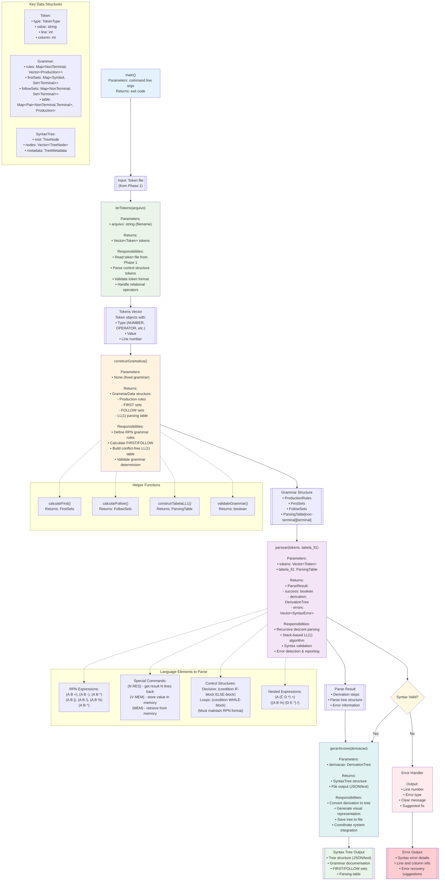

```mermaid
flowchart TD
    %% Main execution flow
    Main["main()<br/>Parameters: command line args<br/>Returns: exit code"] --> InputFile[["Input: Token file<br/>(from Phase 1)"]]
    
    %% Function 1: lerTokens
    InputFile --> LerTokens["lerTokens(arquivo)<br/><br/>Parameters:<br/>• arquivo: string (filename)<br/><br/>Returns:<br/>• Vector&lt;Token&gt; tokens<br/><br/>Responsibilities:<br/>• Read token file from Phase 1<br/>• Parse control structure tokens<br/>• Validate token format<br/>• Handle relational operators"]
    
    %% Function 2: construirGramatica
    LerTokens --> Tokens[["Tokens Vector<br/>Token objects with:<br/>• Type (NUMBER, OPERATOR, etc.)<br/>• Value<br/>• Line number"]]
    
    Tokens --> ConstruirGram["construirGramatica()<br/><br/>Parameters:<br/>• None (fixed grammar)<br/><br/>Returns:<br/>• GrammarData structure:<br/>  - Production rules<br/>  - FIRST sets<br/>  - FOLLOW sets<br/>  - LL(1) parsing table<br/><br/>Responsibilities:<br/>• Define RPN grammar rules<br/>• Calculate FIRST/FOLLOW<br/>• Build conflict-free LL(1) table<br/>• Validate grammar determinism"]
    
    %% Function 3: parsear
    ConstruirGram --> Grammar[["Grammar Structure<br/>• ProductionRules<br/>• FirstSets<br/>• FollowSets<br/>• ParsingTable[non-terminal][terminal]"]]
    
    Grammar --> Parsear["parsear(tokens, tabela_ll1)<br/><br/>Parameters:<br/>• tokens: Vector&lt;Token&gt;<br/>• tabela_ll1: ParsingTable<br/><br/>Returns:<br/>• ParseResult:<br/>  - success: boolean<br/>  - derivation: DerivationTree<br/>  - errors: Vector&lt;SyntaxError&gt;<br/><br/>Responsibilities:<br/>• Recursive descent parsing<br/>• Stack-based LL(1) algorithm<br/>• Syntax validation<br/>• Error detection & reporting"]
    
    %% Function 4: gerarArvore
    Parsear --> ParseResult[["Parse Result<br/>• Derivation steps<br/>• Parse tree structure<br/>• Error information"]]
    
    ParseResult --> GerarArvore["gerarArvore(derivacao)<br/><br/>Parameters:<br/>• derivacao: DerivationTree<br/><br/>Returns:<br/>• SyntaxTree structure<br/>• File output (JSON/text)<br/><br/>Responsibilities:<br/>• Convert derivation to tree<br/>• Generate visual representation<br/>• Save tree to file<br/>• Coordinate system integration"]
    
    %% Decision point
    Parsear --> Decision{Syntax Valid?}
    Decision -->|Yes| GerarArvore
    Decision -->|No| ErrorHandler["Error Handler<br/><br/>Output:<br/>• Line number<br/>• Error type<br/>• Clear message<br/>• Suggested fix"]
    
    %% Final outputs
    GerarArvore --> TreeOutput[["Syntax Tree Output<br/>• Tree structure (JSON/text)<br/>• Grammar documentation<br/>• FIRST/FOLLOW sets<br/>• Parsing table"]]
    
    ErrorHandler --> ErrorOutput[["Error Output<br/>• Syntax error details<br/>• Line and column info<br/>• Error recovery suggestions"]]
    
    %% Helper functions
    subgraph Helpers["Helper Functions"]
        CalcFirst["calcularFirst()<br/>Returns: FirstSets"]
        CalcFollow["calcularFollow()<br/>Returns: FollowSets"]
        BuildTable["construirTabelaLL1()<br/>Returns: ParsingTable"]
        ValidateGrammar["validateGrammar()<br/>Returns: boolean"]
    end
    
    ConstruirGram -.-> CalcFirst
    ConstruirGram -.-> CalcFollow
    ConstruirGram -.-> BuildTable
    ConstruirGram -.-> ValidateGrammar
    
    %% Data structures detail
    subgraph DataStructures["Key Data Structures"]
        TokenStruct["Token:<br/>• type: TokenType<br/>• value: string<br/>• line: int<br/>• column: int"]
        
        GrammarStruct["Grammar:<br/>• rules: Map&lt;NonTerminal, Vector&lt;Production&gt;&gt;<br/>• firstSets: Map&lt;Symbol, Set&lt;Terminal&gt;&gt;<br/>• followSets: Map&lt;NonTerminal, Set&lt;Terminal&gt;&gt;<br/>• table: Map&lt;Pair&lt;NonTerminal,Terminal&gt;, Production&gt;"]
        
        TreeStruct["SyntaxTree:<br/>• root: TreeNode<br/>• nodes: Vector&lt;TreeNode&gt;<br/>• metadata: TreeMetadata"]
    end
    
    %% Language features that need handling
    subgraph LanguageFeatures["Language Elements to Parse"]
        RPNExpr["RPN Expressions:<br/>(A B +), (A B -), (A B *)<br/>(A B |), (A B /), (A B %)<br/>(A B ^)"]
        
        SpecialCmd["Special Commands:<br/>(N RES) - get result N lines back<br/>(V MEM) - store value in memory<br/>(MEM) - retrieve from memory"]
        
        ControlStruct["Control Structures:<br/>Decision: (condition IF-block ELSE-block)<br/>Loops: (condition WHILE-block)<br/>(Must maintain RPN format)"]
        
        NestedExpr["Nested Expressions:<br/>(A (C D *) +)<br/>((A B %) (D E *) /)"]
    end
    
    Parsear -.-> RPNExpr
    Parsear -.-> SpecialCmd
    Parsear -.-> ControlStruct
    Parsear -.-> NestedExpr
    
    %% Styling
    style Main fill:#e3f2fd
    style LerTokens fill:#e8f5e8
    style ConstruirGram fill:#fff3e0
    style Parsear fill:#f3e5f5
    style GerarArvore fill:#e0f2f1
    style Decision fill:#fff8e1
    style ErrorHandler fill:#ffebee
    style TreeOutput fill:#e8f5e8
    style ErrorOutput fill:#ffcdd2
```

